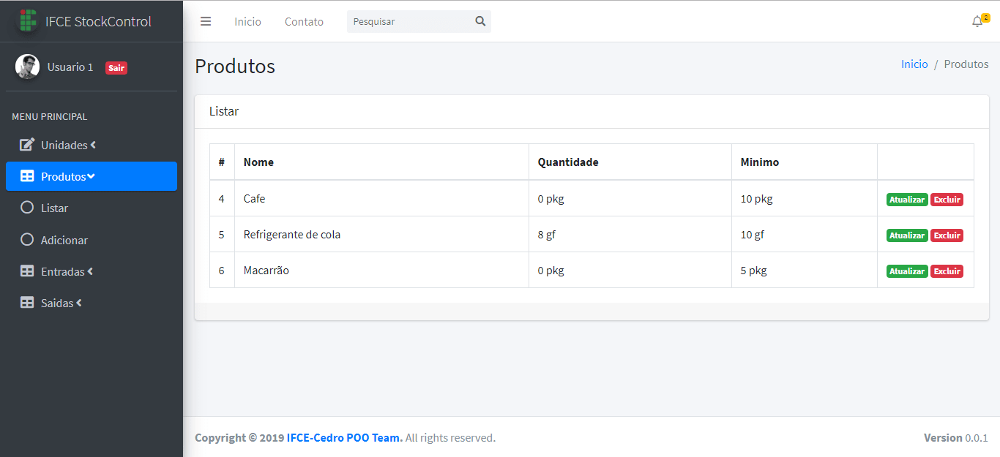

# StockControl IFCE Cedro

Este é um sistema para controle de estoque desenvolvido usando Java com Hibernate e Web API. No processo de desenvolvimento utilizou-se a IDE Eclipse e gerenciador de pacotes Maven.

Foi utilizado o banco de banco MySQL disponível da suíte XAMPP utilizando o ambiente Windows 10.

## Ferramentas de Desenvolvimento

- Eclipse 2019-09
- XAMPP (Apache e MySQL)
- Visual Code
- GIMP

## Bibliotecas utilizadas

- Hibernate
- Java EE Web API
- MySQL Connector

## Ambiente Linux

O sistema também funciona para ambientes linux teste que configurados adequadamente.

## Equipe

- Fabrício
- Felipe Gabriel B. de Souza
- Francisco de A. Silva
- José Ailton B. da Silva
- Issac Santos
- Raimundo Kennedy Costa

# Tela

